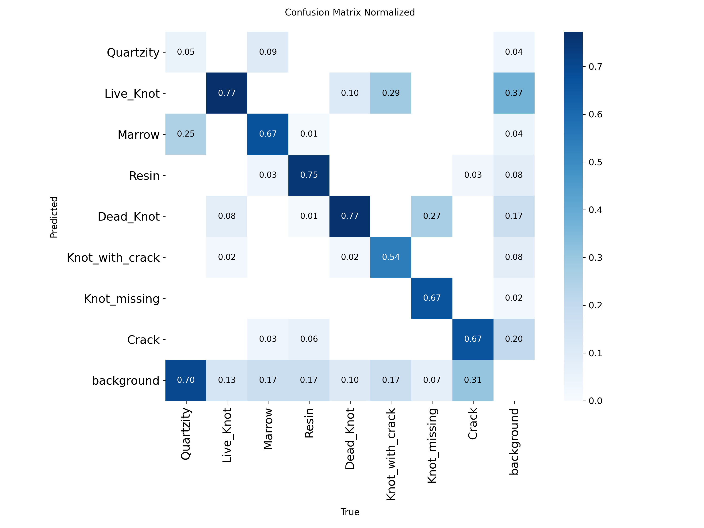

# Progress and Results Log

AI-Based Wood Quality Assessment, VTU major project (DSCE, CSBS, AY 2026-27).
This page is the single place to see what has been done, what every experiment produced, and
what comes next. It is written for someone who has not followed the work day to day.
Detailed reasoning for every decision is in [NOTES.md](../NOTES.md).

Last updated: 7 September 2026, 15:10 IST.

## 1. What the project does

Detect and classify surface defects on sawn timber boards from line-scan images, using
YOLO11 object detection. The deliverable for this phase is a per-class table of Precision,
Recall, F1, mAP50 and mAP50-95 on a held-out test set of physically separate boards, for a
YOLO11m model and (budget permitting) a YOLO11s model trained identically, so that a
"baseline vs proposed" comparison is fair.

Dataset: 4,000-image Kaggle subset of Kodytek, Bodzas and Bilik (2022), *A large-scale image
dataset of wood surface defects for automated vision-based quality control processes*,
F1000Research 10:581, doi:10.12688/f1000research.52903.2. Images are 2800 x 1024 strips,
8 defect classes, 9,211 boxes, 81 physical boards.

## 2. Timeline

| Date | Milestone |
|---|---|
| Before 7 Sep | First model: YOLO11s at 640 square on CPU, 83 epochs. Test mAP50 62.2. Later found to be trained on a leaky split with wrong class names (section 3). |
| 7 Sep, morning | Data audit reproduced and corrected. Real class names found. Board-level split built (seed 42). Dataset and scripts uploaded to Kaggle. |
| 7 Sep, 11:35-14:14 | **Run 1**: YOLO11m, 1024 rect, single T4, 89 epochs. Val mAP50 62.6 on clean boards. |
| 7 Sep, 15:00 | **Run 2** started: same setup, batch 32, lr0 0.001, patience 40. |
| Next | Decide final config on validation, evaluate test once per model, optional YOLO11s run with identical config. |

## 3. Data findings that change how earlier results must be read

1. **Board leakage in the original split.** The first four digits of every filename identify
   the physical board. The old split was done per image tile, so all 81 boards appeared in
   train, validation and test. The old 62.2% test mAP50 is therefore inflated and is not a
   valid baseline. Fix: group-stratified split by board, zero overlap (asserted by script).
2. **Class names were wrong.** The old `data.yaml` used Crack, Knot, Hole, Stain, Split, Warp,
   Decay, Scratch. The Kaggle data card, the box geometry per class id and the paper's class
   frequency ranking all agree on the real names:

   | id | Real name | Old wrong name | Share |
   |---|---|---|---|
   | 0 | Quartzity | Crack | 1.9% |
   | 1 | Live_Knot | Knot | 44.2% |
   | 2 | Marrow | Hole | 2.2% |
   | 3 | Resin | Stain | 7.1% |
   | 4 | Dead_Knot | Split | 31.9% |
   | 5 | Knot_with_crack | Warp | 5.9% |
   | 6 | Knot_missing | Decay | 1.3% |
   | 7 | Crack | Scratch | 5.6% |

   Every per-class statement in the earlier reports refers to a different defect than it names.
3. **Letterboxing.** At 640 square, 63% of the input tensor is padding for a 2.73:1 image.
   Training now uses imgsz 1024 with rectangular batches (1024 x 384).
4. **158 degenerate boxes** (a side of 0 to 1 pixel) were removed. 99 boxes under 5 x 5 pixels
   remain and are flagged for a possible later cleanup.

## 4. Clean dataset (seed 42, split by board, 70/18/12)

| Split | Boards | Images | Background | Quartzity | Live_Knot | Marrow | Resin | Dead_Knot | Knot_with_crack | Knot_missing | Crack |
|---|---:|---:|---:|---:|---:|---:|---:|---:|---:|---:|---:|
| train | 52 | 2817 | 272 | 125 | 2899 | 94 | 489 | 2071 | 377 | 78 | 306 |
| val | 17 | 714 | 71 | 20 | 713 | 64 | 88 | 482 | 98 | 15 | 111 |
| test | 12 | 469 | 45 | 10 | 406 | 46 | 69 | 343 | 30 | 24 | 95 |

Board lists: `dataset_clean/board_split.json` (generated, not committed). Build log:
[prepare_run_seed42.log](../prepare_run_seed42.log).

## 5. Training configuration

Fine-tuned from COCO `yolo11m.pt`. imgsz 1024, rect, AdamW, cosine LR, 100 epochs max, early
stopping on validation, cls 1.0 / box 7.5 / dfl 1.5, grain-safe augmentation (no rotation, no
vertical flip, erasing 0.05, mild HSV), seed 42, deterministic. Full values in
[train_yolo11m.py](../train_yolo11m.py) and each run's `args.yaml`.

Compute: Kaggle, one Tesla T4. Two T4s were tried and rejected because Ultralytics disables
rectangular training under multi-GPU. A run costs about 3 GPU-hours.

## 6. Experiment log

### Kaggle notebook attempts before the first successful run

| Version | Outcome | Cause | Fix |
|---|---|---|---|
| v1 | failed at start | dataset still being processed by Kaggle, not attached | re-push after processing |
| v2 | failed at start | syntax error in generated first cell | regenerate, compile-check cells locally |
| v3 | failed at start | no internet in notebook (account not phone-verified) | phone verification |
| v4 | ran, no training | scripts dataset mounted under a different path | locate scripts by search |
| v5 | failed at model load | Kaggle assigned a P100, unsupported by the image's PyTorch | pin `machine_shape: NvidiaTeslaT4` |
| v6 | OOM at first step | 2 x T4 forces rect off; batch 32 at 1024 square does not fit | single GPU, batch 16 |
| v7 | **Run 1, success** | | |

### Run 1: YOLO11m, 1024 rect, batch 16, lr0 0.002 (notebook v7)

Artefacts: [runs_log/run1_yolo11m_1024rect_v7](../runs_log/run1_yolo11m_1024rect_v7/)
(results.csv, args.yaml, PR/F1/P/R curves, confusion matrices, results.png).

- 89 epochs in 2.54 h (about 103 s per epoch). Early stopping at patience 25; best epoch 64.
- Inference on T4: 19.5 ms per image, about 47 FPS end to end at 1024 rect.
- **Test set not evaluated yet** (held for the final configuration, evaluated exactly once).

Validation results, best.pt, 714 images, 1,591 boxes, 17 boards:

| Class | Boxes | P | R | mAP50 | mAP50-95 |
|---|---:|---:|---:|---:|---:|
| **all** | 1591 | 61.0 | 62.5 | **62.6** | **33.7** |
| Quartzity | 20 | 6.6 | 5.0 | 4.3 | 2.5 |
| Live_Knot | 713 | 77.2 | 75.5 | 76.7 | 33.3 |
| Marrow | 64 | 75.4 | 70.3 | 72.8 | 41.3 |
| Resin | 88 | 69.9 | 73.9 | 71.2 | 34.7 |
| Dead_Knot | 482 | 78.5 | 74.9 | 81.8 | 42.6 |
| Knot_with_crack | 98 | 61.7 | 64.3 | 61.7 | 40.0 |
| Knot_missing | 15 | 69.1 | 74.6 | 81.4 | 47.3 |
| Crack | 111 | 49.4 | 61.3 | 51.1 | 27.7 |

Interpretation:

- 62.6 on physically separate boards is not a regression from the old 66.3, which was leaky.
  Excluding Quartzity, the mean mAP50 over the other seven classes is 70.9.
- Crack improved to 51.1 from 42.2 (old, leaky, reported under the name Scratch) despite the
  harder split: the resolution fix worked.
- Quartzity collapsed: 70% of its boxes are predicted as background and 25% as Marrow. It has
  125 training boxes and is a faint streak along the grain. It alone costs about 8 points of
  overall mAP50.
- The remaining confusions are knot subtypes: 29% of Knot_with_crack is predicted as
  Live_Knot and 27% of Knot_missing as Dead_Knot.
- The validation curve was noisy, with several 10-15 point drops in mAP50 and two large
  classification-loss spikes, which motivated run 2.

### Run 2: YOLO11m, 1024 rect, batch 32, lr0 0.001, patience 40 (notebook v8), in progress

Started 7 Sep 15:00 IST. Batch 32 fits in 13.9 GB. Epoch 1 classification loss 4.7 versus
12.5 at the same point in run 1. Results will be added here when it finishes.

## 7. Rules followed throughout

- Nothing is tuned on the test split; all decisions use validation. Test is run once per final
  model.
- Metrics are always reported as Precision, Recall, mAP50 and mAP50-95 separately.
- `best.pt` (by validation) is evaluated, never `last.pt`.
- Seed 42 everywhere. Every deviation from the base configuration is logged in NOTES.md.

## 8. Next steps

1. Compare run 2 with run 1 on validation; if stable and not worse, adopt its settings.
2. Optionally one more iteration (drop sub-5-pixel boxes, or imgsz 1280 rect for the thin
   classes), decided on validation.
3. Evaluate the final YOLO11m on the test split once; publish the per-class table here.
4. If GPU quota remains (about 24 h of the weekly 30 h after run 2), train YOLO11s with the
   identical final configuration and evaluate it once, giving the baseline-vs-proposed table.
5. Rework the synopsis: sawn timber instead of plywood, real class names, YOLO11, citation.

## 9. Where things are

- Scripts: `prepare_dataset.py`, `train_yolo11m.py`, `evaluate.py` (repo root).
- Kaggle: private datasets `prakyats/wood-defects-clean` and `prakyats/wood-defects-scripts`;
  notebook `prakyats/yolo11m-wood-train` (versions listed above). Notebook source and metadata
  are in [kaggle_upload/](../kaggle_upload/).
- Weights are not committed. Run 1 `best.pt` (40.5 MB) is in the notebook v7 output under
  `persist/yolo11m_1024rect/`.
- Team brief for collaborators: [TEAM_BRIEF_2026-09-07.md](TEAM_BRIEF_2026-09-07.md).
